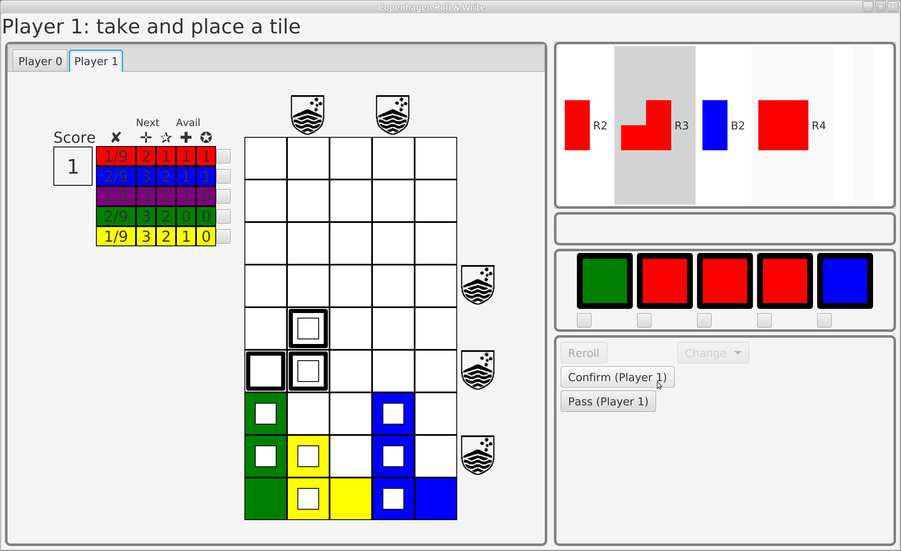
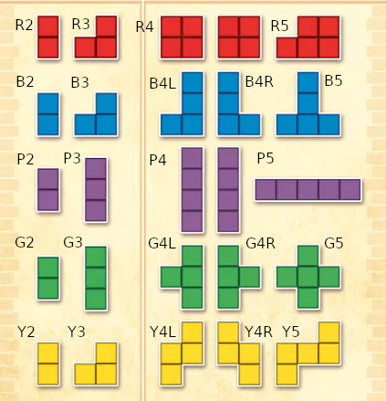
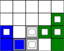
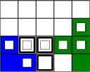
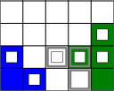
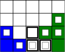
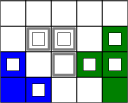

# COMP1110/1140/6710 Semester 2 2024 Assignment 2

## Purpose

In this assignment you will implement a game. It will be a desktop version
of a pen-and-paper game. A GUI (graphical user interface) is provided, that
you can use, but you have to build the "backend" of the program, that
implements the game logic, from scratch. This means you will create a
larger piece of code, consisting of several classes that work together
and that integrate with a given framework (the GUI).

You are not required to use the predefined GUI as it is: if you want your
game to look different, you can modify it, or even replace it completely.
As long as your game follows the rules and is easy to play, it is ok.

## Group work and academic integrity

For this assignment you are allowed to work in groups of up to at most
three. Groups **must be declared**, using the group sign-up on the course
wattle site.

**Collaboration between groups is not allowed**.

This does not mean you cannot discuss the assignment with, or ask
questions of, the teaching staff and others in the class.
However, *you must never misrepresent the work of others as your own*.
If you have used ideas from anyone or anywhere, or used any code that is
not entirely your own creation, you must make this absolutely clear.
At each stage of the assignment you will be asked to submit a statement
of originality, either as a group or as individuals.
This statement is the place where  you must to declare which ideas or code
contained in your submission were sourced from anyone or anywhere else.

Please read the ANU's
[official position](http://academichonesty.anu.edu.au/) on academic honesty.
If you have any questions, please ask a lecturer, tutor, or make a post
on the Ed forum.

Carefully review the statements of originality in the [admin](admin)
folder which you must complete at each stage. Edit the relevant
statement and update it as you complete each stage of the assignment,
ensuring that when you complete each stage, a truthful statement is
committed and pushed to your repo.

## Assignment deliverables

The assignment is worth 35% of your total assessment, and it will be marked
out of 35. The assignment consists of several deliverables:

*   D2B: Initial design (2 marks). Due in your week 6 lab.
*   D2C: First stage implementation (6 marks). Due at **6pm on Friday
	the 20th of September** (the Friday in semester week 7).
*   D2D: Test plan and unit test (2 marks). Due in your week 8 lab.
*   D2E: Integration test and code review (2 marks). Due in your week 9 lab.
*   D2F: Final implementation (21 marks). Due in semester week 11.
*   D2G: Presentation (2 marks). Due in your week 12 lab.

For some deliverables you will get a _project_ mark, which is based on
the project as a whole and is shared equally by all members of the
group if the project is done by a group; for other deliverables each
student will be _individually_ marked (regardless of whether they are
in a group or not).

## Project repository structure

Your work will be marked by accessing your git repo, so it is essential
that you carefully follow the instructions below for setting up and
maintaining your group repository.

*   You must have a folder called admin in your base directory (not
    "Admin" or any other variation). This folder should have been in
    your repository since the beginning.
*   Your admin folder must each of the required files (described for
    each deliverable below), using exactly the file names
    specified. These should have been in your repository since the
    beginning (although you must fill in the details).
*   Your admin folder should not have any sub-folders in it.
*   You must have a build artifact setup to create a working
    `out/artifacts/game/game.jar` file automatically when your project
    is built (see D2E instructions).
*   All of your source code must be in the repository, in a folder
    called `src`.

At each deadline you will be marked according to whatever is pushed to
your repository at the time of the deadline. You will also be assessed
on how effectively you use git as a development tool.

## The game: Copenhagen Roll & Write

The game is called
["Copenhagen Roll & Write"](https://boardgamegeek.com/boardgame/282463/copenhagen-roll-and-write).
It was published by [Queen games](https://new.queen-games.com/) in 2019,
but now appears to have disappeared from their web site. However, we
assume that they still have the copyright to the game, and note that we
are using it without express permission, and only for educational purposes.
Note that there is another game, called just "Copenhagen" (not the roll &
write version), that is similar, but that is not the game we're using.

You can find a copy of the rules booklet in the `assets` directory.
Below is a brief summary of how the game is played, but you should read
the game rules to make sure you have a clear understanding. If anything
is unclear, post a question to the course forum (though you should, of
course, first check if the same question has already been answered).

### Game overview

The game can be played by 2-4 players. Each player has their own
_score sheet_, on which they will mark the progress in building their
building facade, and completing and using their ability/bonus tracks.
There is also a common _facade sheet_, which shows the available
tiles.

Players take turns. Each turn, the current player rolls five dice with
six different colours: red, blue, purple, green, yellow and white.
The white colour acts as a wildcard (can represent any colour the
player wants). The player then uses the dice to choose an available
tile from the facade sheet, and places (draws) that tile on their
building (see description of placement rules below). Tiles of size two
and three are available in unlimited supply, but the larger tiles
(four and five) can only be used once (except with the use of special
abilities, see below): when a player uses one of those tiles, it is
crossed out on the facade sheet.
Next, all of the other players select one of the remaining dice (not
used by the player to pick a tile), and mark off one box on their
corresponding _ability track_ (again, if a white die remains, it is
a wildcard allowing the other players to mark any track they choose).
The turn then passes to the next player.

### Placing tiles

Each tile added to a player's building facade must not overlap with
any tile already placed, and at least one square of the tile must
"rest on" (i.e., be immediately above) a square that is already filled,
or the base of the building.

When a player places a tile, they also draw a "window" on all but
one of the squares covered by the tile. (Using one of the special
abilities allows the player to draw windows on all squares in the
tile; see below). The windows are important for scoring: completing
a full row or column of the building with all windows is worth twice
as many points as completing it with some windowless squares.

### Bonuses and abilities

As players advance (mark off) squares along their ability tracks, they
will unlock bonuses (shown with a +) and special abilities (shown
with a star) that they can use later (in their turns). Each unlocked
bonus or ability can only be used once.

Bonuses can be used as extra dice to select a bigger tile than the
player would otherwise be able to. For example, if a player has rolled
three blue and two other colours (not white), they would normally only
be able to choose a blue size three tile, but by using (crossing off)
a blue bonus, they can choose a size four instead, and by using two
blue bonuses, they can choose a size five. (There is no limit on how
many bonuses can be used at the same time, as long as the player has
enough unlocked and unused bonuses.)

The special abilities have different effects, depending on their colour:

*   The red ability allows the player to reroll one or more of their
	dice. (The player can choose which dice to reroll and which to keep.)
*   The blue ability allows the player to add an extra window when placing
	a tile. This means all squares on the tile will have windows.
*   The purple ability allows the player to place an extra single-square
	tile. The tile does not have a window, but using the combination of
	a purple and a blue ability allows the player to also put a window on
	the single-square tile.
*   The green ability allows the player to change any number of dice
	that have the same colour to another colour of their choice.
*   The yellow ability allows the player to pick one of the single-use
	(size four or five) tiles from the facade sheet even if that tile
	has already been used.

Note that each unlocked ability (star on the track) can be used only once,
and is crossed off when used.

In general, the player whose turn it is can used abilities at any time
during their turn, and can use as many abilities as they have available.
For example, a player can use a red ability to reroll some dice before
picking a tile to place, but can also reroll, or use the green ability
to change some dice, after they have placed their tile, but before the
other players select an ability track to mark. The player can also reroll
several times, as long as they have unlocked and unused red abilities
remaining. Likewise, a a player can use the purple (or purple and blue
combination) to place an extra single-square tile either before or after
picking and placing a tile from the facade sheet, and can place as many
extra single-square tiles as their available abilities allow.

Some rows and columns on the player's building are marked with a
coat-of-arms ("shield") in the margin. Whenever a player completes one
of these rows or columns, they get an immediate effect: they can either
add an extra single-square tile with a window, or they can advance one
of their ability tracks by two steps. Note that the coat-of-arms effect
has to be used immediately.

### Scoring and game end

Players score points as follows:

*   Completing a row of their building with windows in all squares of
	the row: 2 points.
*   Completing a row of their building, but not with windows in all
	squares of the row: 1 point.
*   Completing a column of their building with windows in all squares of
	the column: 4 points.
*   Completing a column of their building, but not with windows in all
	squares of the column: 2 points.
*   Completing one of their ability tracks: 2 points.

The game ends on the round when one player's score reaches 12. All players
who have not yet had their turn in the current round will take their turns
(so that all players have had the same number of turns) and after that the
player with the highest score is the winner.

## Graphical user interface

A graphical user interface (GUI) for the game will be provided, after the
design deliverable (week 6). An image of the GUI is shown below:



The GUI has elements that represent all the components of the game: the
available dice, the selectable tiles from the facade sheet, and each
player's score sheet, and has functionality that lets the user interact
with them, for example, to select dice, select and place tiles, and so
on. However, the GUI implements none of the game's rules or logic. For
example, it does not restrict what tiles the user can select, or where
they can place them, it does not record them once placed, does not keep
track of score or turn order, and so on.

Your task is to design and implement a collection of classes that
represent and update the state of the game and enforce the game rules,
and to connect your implementation to the GUI such that the user can
play the game.

[`GameTemplate.java`](src/comp1110/ass2/GameTemplate.java) gives you an
example of what the main program file will look like. The `start` method
(which replaces `main` for JavaFX applications) creates an instance of
the `GameGUI`, which represents your interface to the GUI. You will need
to complete this method by registering callbacks for the `gui` object.

The public interface of the `GameGUI` class contains the following methods:

*   `public GameGUI()`

	Create a new instance of the GUI. This should only
	be done once, at the beginning of the `start` method as shown in
	[`GameTemplate.java`](src/comp1110/ass2/GameTemplate.java).

*   `public void setMessage(String msg)`

    Set the text in the message field (at the top of the GUI).

*   `public void setAvailableTiles(List<String> tiles)`

    Set the list of tiles to be shown in the tile selection (top of
	the right-side panel). This will also clear any current selection.

*   `public void clearTileSelection()`

    Unselect the currently selected tile, if any. This does not change
	which tiles are shown in the tile selector.

*   `public void setAvailableDice(List<String> colours)`

    Set list of dice (colours) to be shown in the dice view. This will
	also clear any current dice selection.

*   `public void clearDiceSelection()`

    Unselect all currently selected dice. This does not change which
	dice are shown in the dice view.

*   `public List<Integer> getSelectedDice()`

    Returns a list of indices of the currently selected dice. The dice
	are indexed from 0 to the number of dice shown - 1, from left to
	right.

*   `public void setFacadeSquare(int player, int x, int y, String colour, boolean window)`

	Set a square a player's building view to show the specified colour
	and window.

	Use colour = `"White"` and window = `false` to make a square appear
	empty.
	
	Parameters:
	* `player` The player whose building should be updated (from 0 to
	number of players - 1).
    * `x` The x position (column) of the square. Columns are indexed 0 to 4,
	from left to right.
    * `y` The y position (row) of the square. Rows are indexed 0 to 8, from
	the bottom to the top.
    * `colour` The colour to show. This must be one of the strings `"Red"`,
	`"Blue"`, `"Purple"`, `"Green"`, `"Yellow"`, `"Gray"`, or `"White"`.
	The colour can be abbreviated to the initial letter only.
    * `window` `true` if the square should show a window, `false` if it
	should not.

*   `public void setRowCoA(int player, int y, boolean highlightOn)`

    Set the highlight status of the coat-of-arms next to a row in one
	player's building.

	Parameters:
	* `player` The player whose building should be updated (from 0 to number of players - 1).
	* `y` The row index. This must be one of the numbers `1`, `3` or `5`.
    * `highlightOn` Whether the CoA should be highlighted (shown in gold
	colour) or not (shown in black).

*   `public void setColumnCoA(int player, int x, boolean highlightOn)`

    Set the highlight status of the coat-of-arms above a column in one
	player's building.

	Parameters:
	* `player` The player whose building should be updated (from 0 to number of players - 1).
	* `x` The column index. This must be one of the numbers `1` or `3`.
    * `highlightOn` Whether the CoA should be highlighted or not.

*   `public void setScore(int player, int score)`

	Set the score shown on one of the player's score sheet.

	Parameters:
    * `player` The player whose score should be updated (0 to number of players - 1).
    * `score` The new score.

*   `public void setTrackInfo(int player, String colour, int nMarked, int nBonusAvailable, int nAbilityAvailable, int nBonusToNext, int nAbilityToNext)`

    Update the information to be shown for one of a player's ability tracks.
	
	Parameters:
    * `player` The player whose ability track should be updated (0 to number of players - 1).
    * `colour` The colour of the track. Must be one of "Red", "Blue", "Purple", "Green" or "Yellow".
    * `nMarked` Number to be shown in the "X" column.
    * `nBonusAvailable` Number to show in the "Avail/+" column.
    * `nAbilityAvailable` Number to show in the "Avail/star" column.
    * `nBonusToNext` Number to show in the "Next/+" column.
    * `nAbilityToNext` Number to show in the "Next/star" column.

*   `public void clearTrackSelection()`

    Clear track selection.

*   `public List<Integer> getSelectedTracks()`

    Returns a list of indices of the currently selected track(s).
	Tracks are indexed 0-4, from Red to Yellow.

*   `public void endGame(int[] finalScores)`

    End the current game. This will bring up the end of game screen
	(in the lower right corner), which shows the final scores and offers
	the choice to quit or play again.

*   `public int getSelectedPlayer()`

    Returns the index of the player whose score sheet is currently being
	shown in the left part of the GUI. The index ranges from 0 to number
	of players - 1.

*   `public void setAvailableActions(List<String> actions)`

	Set the list of possible player actions to appear when the "Action..."
	menu button is pressed. The handler associated with these actions is
	set using `setOnGameAction`.

*   `public void setControlPlayer(int i)`

    Set the text on the Confirm and Pass buttons to indicate that the
	current decision belongs to player `i`.

*   `public void setOnStartGame(BiConsumer<Integer, boolean[]> handler)`

    Set the event handler to be called when a new game is started.
    The handler will receive two arguments: the number of players (an
	integer) and an array of boolean values, of the same length as the
	number of players, indicating which players should be AI controlled.
	If your game does not have an AI, you can ignore the second argument.
	Note: The `BiConsumer` functional interface is defined in the
	`java.util.function` package.

*   `public void setOnTileSelected(Consumer<String> handler)`

    Set the event handler to be called when the user selects a tile
	(from the list at the top of the right right panel). The handler will
	receive one argument, which is the name of the tile.

	The selected tile will also be displayed as a "candidate" (outline)
    on the building display of the currently selected player's score sheet.

	Note: The `Consumer` functional interface is defined in the
	`java.util.function` package.

*   `public void setOnTilePlaced(Consumer<Placement> handler)`

    Set the event handler to be called when the user confirms placement
	of a selected tile. The handler will receive one argument, which is
	an object of type `Placement` that contains all the details of the
	intended placement. Details of the `Placement` class are described
	further below.

*   `public void setOnDiceSelectionChanged(IntConsumer handler)`

    Set the event handler to be called when the user changes the selection
	of any die in the dice diplay. The event handler will receive one
	argument, which is the index of of the die whose selection status has
	changed. This event only informs the handler that a dies selection has
    changed, not whether the die is now selected or unselected. You can
	use the `getSelectedDice()` method to get the indices of currently
	selected dice.

*   `public void setOnTrackSelectionChanged(IntConsumer handler)`

    Set the event handler to be called when the user changes the selection
	(checkbox) of any of the ability tracks. The event handler will
	receive one argument, which is the index (0-4) of the track whose
	selection status has changed. This event only informs the handler that
	a selection has changed, not whether the track is now selected or
	unselected. You can use the `getSelectedTracks()` method to get the
	indices of currently selected tracks.

*   `public void setOnConfirm(Consumer<String> handler)`

    Set the event handler to be called when the "Confirm" button is pressed
	in any situation except when it is pressed to confirm a tile placement
	(this will generate a call to the tile placed event handler instead).
    The event handler will receive one argument, which is the current label
	of the button.

*   `public void setOnPass(Consumer<String> handler)`

    Set the event handler to be called when the "Pass" button is pressed.
	The event handler will receive one argument, which is the current label
	of the button.

*   `public void setOnGameAction(Consumer<String> handler)`

    Set the event handler to be called when an item from the "Action"
    menu button is selected. The event handler will receive one argument,
    which is the label of the menu item. The list of available actions
	is set with `setAvailableActions`.

### Tile placements

A tile placement consists of five pieces of information:

*   The tile _name_. The names of the different tiles are shown in the
	image below:

	

	Note that the blue, green and yellow size 4 tiles each have a "left"
	and a "right" version, but the red and purple do not.

	In addition to these, there are two special tile names:

	-   `S1X` represents a 1x1 tile without a window
	-   `S1O` represents a 1x1 tile with a window

*   The placement column (x coordinate). The columns are index 0 to 4,
	from left to right.

*   The placement row (y coordinate). The rows are index 0 to 8, from
	the bottom to the top of the building.
	
	The position of the placement (x,y coordinate) refer to the square
	that is the lower left corner of the tile's rectangular bounding
	box at its specified rotation.

*   A rotation. The rotation is an integer from 0 to 3. Rotation 0 is
	the tile as shown in the facade sheet (image above). Each increment
	means a clockwise rotation by 90 degrees, that is, a rotation of 1
	means the tile is turned on its right side, a rotation of 2 means the
	tile is upside-down, and a rotation of 3 means the tile is turned on
	its left side.
	
*   The window arrangement. This is an array of boolean values, of the
	same length as the size of the tile. The squares that make up each
	tile are numbered, from 1 to the size, by column in order from left
	to right, and in order from bottom to top within each column, when
	the tile is its original orientation (as in the image above). When
	the tile is rotated, the numbering of the squares rotates along with
	it. Each value in the array represents if a window is present on the
	corresponding square of the tile.

The `Placement` class has the public methods to retrieve each of these
pieces of information:

*   `public String getTileName()`
*   `public int getX()`
*   `public int getY()`
*   `public int getRotation()`
*   `public boolean getWindow(int i)`

Note that `getWindow` does not return the array, but the value at the
specified index in it.

Examples of tile placements are shown in the D2C section below.

## Requirements and evaluation criteria

The marking criteria are different for each of the assignment deliverables.

### D2B

For this deliverable, you will need to provide an initial design for your
project. The files you need to provide are:

*   A pdf file containing a _sketch_ of your design (committed as
	`admin/B-design.pdf`)
*   A design skeleton consisting of one or more Java classes, with key
	field and method declarations, but without any method implementations.

The design sketch is exactly that: a diagram, prepared using whichever
tools you want (it's perfectly fine to draw it on paper and photograph it).
The diagram should indicate how the major elements of your game will fit
together. You are free to use whatever notation you feel works.
The goal is to capture your group's design in a simple diagram.
You must also write the skeleton of what you plan to build. This means
deciding on what classes you think you will need and what fields and
methods you think these classes will have, and brief comments (in javadoc
form) describing their purpose.
However, the methods should not have an implementation in them.
You are merely submitting a skeleton (not working code!)
Your classes and pdf must be pushed to GitLab by the deadline.

In addition to the files specified above (`admin/B-design.pdf` and your
skeleton class files), you must also complete and sign (by all group
members) the statement of originality (`admin/B-originality.yml`). Your
edits to this file must also be committed and pushed before the deadline.

#### Evaluation criteria for D2B

*   Required admin files (`B-originality.yml`) have been correctly filled
	in, committed and pushed by the deadline.
*   You have committed and pushed a design diagram as a PDF file
	(`admin/B-design.pdf`).
*   Your diagram presents a reasonable design for the game.
*   You have committed and pushed a skeleton design (java files).
*   Your skeleton classes, and their fields and methods, are appropriately
	named, and have suitable documentation (comments).
*   Your skeleton design matches what is in your design diagram.

D2B is a project deliverable: the design will be marked for the group
as a whole, and all group members will receive the same mark for it.

It is perfectly fine to change your design later in the semester. The
goal of this deliverable is to demonstrate that you have carefully
thought about the design before you start coding.

### D2C and D2F

Deliverables D2C and D2F will be marked on what is in your project
repository (on gitlab) at the time of their respective deadlines. For
these deliverables, we will consider the _functionality_ and _quality_
of your code. Functionality means the extent to which the game is
playable (and follows the game rules), as well as specific
functionality, demonstrated by testing and/or inspection. Quality
includes aspects such as the organisation and structure of your code
(i.e., roughly the same criteria as the design, but for the
implemented code), appropriate naming, good use of comments to
document higher-level units (classes, methods) as well as to provide
information about the implementation where it is needed.

#### Evaluation criteria for D2C

At this stage, we want to see that you have taken steps towards turning
your design into a working implementation. Specifically, at this stage
you should have constructors for all your classes, so that you can create
instances of the game and set up test cases. You should also create test
methods for at least two test cases, that test the functionality of some
(significant) part of your code:

1.  Create an instance of the game for two players, set the available
	dice to three red, one blue and one white. Test your code for
	checking if the current player can select the red size 3 tile
	(should be allowed), the red size 4 tile (should be allowed) and
	the blue size 3 tile (should not be allowed).

2.  Create an instance of the game for two players, and add two tiles
	to the first player's building, as shown in the examples below. The
	two tile placements are:

	*   tile = "B3", x = 0, y = 0, rotation = 1, windows = [true, false, true];	and
	*   tile = "G4L", x = 3, y = 0, rotation = 0, windows = [true, false, true, true].

	Test your code for checking valid tile placement with the following
	examples:

	*   
		tile = "Y3", x = 1, y = 0, rotation = 0 (not valid)

	*   
		tile = "Y3", x = 1, y = 0, rotation = 3 (valid)

	*   
		tile = "Y3", x = 2, y = 0, rotation = 3 (not valid)

	*   
		tile = "Y3", x = 2, y = 0, rotation = 1 (valid)

	*   
		tile = "Y3", x = 1, y = 1, rotation = 3 (not valid)

You should write your test methods in a dedicated test class, called
`D2CTest`.

Note: Your tests should **not** interact with the GUI (i.e., should
not create the visual display for the test cases), but should
construct instances of your internal representation of the corresponding
game state.

You can of course create more examples than the two specified above.
Generally, tests should be for a non-trivial functionality in a
non-trivial situation.

The evaluation criteria are as follows:

*   All required admin files are correctly filled in, committed and
	pushed before the deadline.

*   The project compiles ("build" CI test passes), and runs without
	error on CSIT lab computers.

*   All classes have constructors. (These should be "real"
	constructors, that create usable instances of the classes; not
	just empty placeholders.)

*   The test methods are runnable. (Your implementation may not pass
	the tests that you have defined at this point, if you have not
	yet completed the implementation of the functionality that they
	are testing, but you should at least be able to create the test
	scenarios.)

*   The test methods are clearly documented. For each, you should
	describe the test situation (for example, as described in the
	examples above), describe what method(s) are being tested, and
	the expected result.

*   The test methods are correct, in the sense that they construct
	and test the scenarios described above.

#### Evaluation criteria for D2F

*   All required admin files are correctly filled in, committed and
	pushed before the deadline.

*   The project compiles ("build" CI test passes), and runs without
	error on CSIT lab computers.

*   The game is playable, and follows the game rules.

	This is **not** an all-or-nothing criterion. There are many
	aspects to the game being playable and correct, for	example:

	*   The game does not crash (exit with error).
	*   The game follows the player turn order and action sequence.
	*   The game is set up for the correct number of players (chosen
		on the start-up screen).
	*   The game allows the current player to select and place a tile
		on their building.
	*   The game correctly shows which tiles have been placed (squares
		have been filled) on a player's building, including which have
		windows.
	*   The game only allows the current player to select and place a
		tile.
	*   The game only allows the current player to select a tile that
		they can select according to the rules (i.e., that they have
		enough dice, or dice and bonuses, for, and that is still
		available).
	*   The game only allows the current player to place a tile where
		it is legal according to the game rules.
	*   The game allows the other players to select an ability track
		after the current player has placed a tile (and finished taking
		any other actions).
	*   The game only allows the other players to select an ability
		track that matches the colour of one of the remaining dice.
	*   The game correctly identifies when a player has filled a row
		or column, and updates the score.
	*   The game identifies when a player has filled a row or column,
		and updates the score correctly.
	*   The game identifies when a player has filled a row or column
		that unlocks a coat-of-arms, and shows this on the interface.
	*   The game allows the player to take one of the two extra actions
		when they unlock a coat-of-arms.
	*   The game correctly identifies, and shows, when bonuses and
		abilities become available as players advance their ability
		tracks.
	*   The game correctly identifies when a player has completed an
		ability track, and updates their score.
	*   The game allows the current player to use bonuses and/or
		abilities in their turn.
	*   The game correctly identifies, and shows, the number of unlocked
		and unused bonuses and abilities of each colour that a player
		has remaining.
	*   The game allows the current player to use several bonuses and/or
		abilities (if available) during a turn, and to use abilities in
		any order.

	The more of the criteria above your game exhibits, the higher we
	will judge its functionality to be.

*   There are documented unit tests for classes and methods of significant
	complexity.

	There does not have to be unit tests for every single method in every
	single class, but it is good practice to write tests for any method
	that does something that is not	trivial.

	It is not required that you implement exactly the tests that were
	described in your test plan (from D2D). The adequacy of testing is
	assessed on what is implemented (not what was planned).

*   The code is well designed and written. This includes aspects such as:

	*   Good use of classes and methods to create abstraction and
		encapsulation of implementation details.
	*   Appropriate use of standard library components.
	*   Good naming (for classes, methods/fields, and parameters/variables).
	*   Appropriate use of javadoc comments to document classes and
		methods.
	*   Informative inline code comments where appropriate.

### D2D

There are two elements to this deliverable, a group component and an
individual component.

The purpose of this deliverable is to ensure that each group is making
plans for how to test all important parts of their project.

#### D2D Unit test (Individual)

You must show the tutor one or more working JUnit tests that you have
created. The tests must be for some class or method that is part of your
design (i.e., code that you actually plan to use in your final game),
but the implementation of the class or method does not have to be
finished. The test should be for a non-trivial method, or a non-trivial
combination of methods from a class. For example, just testing one or
more simple setter or getter methods is not sufficient.

#### D2D Test plan (Group)

The group must edit, commit, and push the following to their repository
before their scheduled lab:

*   `admin/D-originality.yml` Statement of originality for D2D.
*   `admin/D-test-plan.md` Test plan.

#### Evaluation criteria for D2D Test plan

The purpose of test planning is for the group to identify which
components of your game should be unit-tested. The test plan is a
simple document, which should:

*   List the classes in your implemented design that should have some
	unit testing.
*   For each class, list methods that can be tested in isolation.
*   For each class, if there are conditions on the class' behaviour that
	cannot be tested by calling one method in isolation, give one example
	of a test for such a condition. A very simple example could be
	something like "After calling add(...), the number returned by size()
	has increased by 1."

You do not have to implement the tests at this point. However,
implementation of appropriate unit tests is one of the critera that
will be evaluated in your final code submission (D2F).

If your implemented design does not have any classes or methods that
can be unit-tested then it is not a good design, and your group will
not be eligible for the marks associated with this deliverable.

In addition, your group mark for D2D will be affected by the following:

*   Required admin files have been correctly filled in, committed and
	pushed before the deadline.

### D2E

There are two elements to this deliverable, a group component and an
individual component.

Both components should be completed before your scheduled lab in Week
9 and will be assessed by your tutor in the lab.

### D2E Integration (Group)

This week you must demonstrate that all of your classes work
together. You should package your program as a JAR file called
`game.jar`.

Note: getting your program working as a JAR file can sometimes be
tricky, so make certain you work this out with plenty of time ahead
of the deadline. You should be able to do so using the following steps
in IntelliJ:

*   Select File->Project Structure.
*   Select "Artifacts"
*   Add a JAR: "+" -> JAR -> From modules with dependencies...
*   Select the "Main class" to be your Game class, and ensure
	"extract to target JAR" is selected
*   Ensure the "Directory for META-INF/MANIFEST.MF" is set to your `src`
	subdirectory.
*   Press "OK"
*   Change the "Name" to game.
*   Ensure the "Output directory" is the subdirectory `out/artifacts/game`
	relative to the project root directory.
*   Check the "Include in project build" checkbox.
*   Change the file name by selecting the JAR at middle of window,
	under "Output layout", and right click, "Rename", then type
	`game.jar`
*   Press "OK"
*   Build game JAR: Build -> Build Artifacts..., select build.
*   Use git to commit the `.idea/artifacts/game.xml` and `src/META-INF/MANIFEST.MF` files (do not include `out/artifacts/game/game.jar` in version control).

Your JAR should now be visible under `out/artifacts/game/game.jar`. Note, don't commit this to version control, it will be reconstructed each time your project is built. Ensure that you can run the JAR external to intellij, e.g., from the command line within the root of your project directory run:

```
java --module-path ${PATH_TO_FX} --add-modules=javafx.base,javafx.controls -jar out/artifacts/game/game.jar
```

Your game should run, creating a new window.

Note: If the `PATH_TO_FX` variable is not set in your shell (only in IntelliJ),
you may need to replace the expression `${PATH_TO_FX}` with the actual path
to where JavaFX is installed. On the CSIT lab computers, this is in
`/usr/local/openjfx/lib`.

If you run into troubles with these steps, you can start over by doing
steps 1 and 2 and then using the "-" sign to delete the artifact. Also
see IntelliJ documentation on how to build a JAR.

In addition, the group must edit, commit, and push the originality statement
for D2E (`admin/E-originality.yml`) before the deadline.

#### Evaluation of D2E Integration

*   All required files are correct and have been committed and pushed,
    passing the CI compliance test.
*   Git log provides evidence of healthy teamwork and appropriate use
    of version control.
*   All classes compile without error and the game can run (it does
    not yet need be a complete game implementation, but it should be
    possible to start without error).
*   The game executes from the JAR file on the CSIT lab machines.


### D2E Code review (Individual)

Each group member will be required to present to their tutor a part of
the project code that they have written themselves, and answer questions
on their design and implementation choices. The tutor will select an
appropriate code section (from those you have written). This code should
_not_ be a test; it should be a part of your implementation of the game.

### D2G

Each group is expected to give a short (approximately 5 minutes)
demonstration of their project and answer questions from the audience.
Presentations will be made in the week 12 lab.

## Extensions for COMP1140

Students enrolled in COMP1140 will be evaluated on some additional
criteria for deliverable D2F. These criteria also refer to the
functionality and quality of the code.

*   Appropriate use of generics, abstract classes and/or interfaces
	to improve reusability and flexibility of own code components.

	Features such as abstract classes/interfaces and inheritance are
	an important part of object-oriented design, but can be more
	difficult to use wisely.

*   Support for one or more players to be controlled by AI.

	The GUI provides the user with a choice, when starting a new game,
	to let one or more of the players be controlled by AI. Implementing
	support for this is not required in the standard version of this
	assignment, but will be considered in the evaluation for COMP1140.

	Note that the evaluation of the AI functionality is _not_ based on
	how good the AI is at playing the game, but on how the flexibility
	to choose between user and AI control of players in the game is
	achieved in the game's design and implementation.
